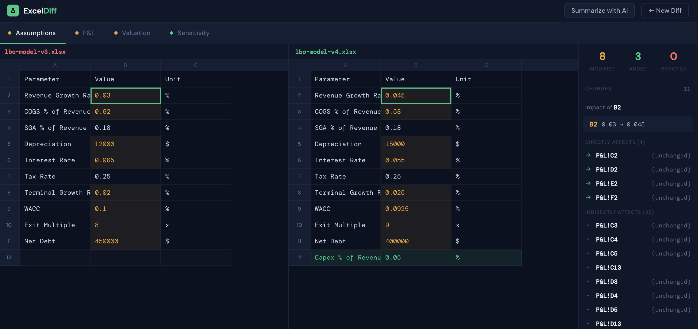
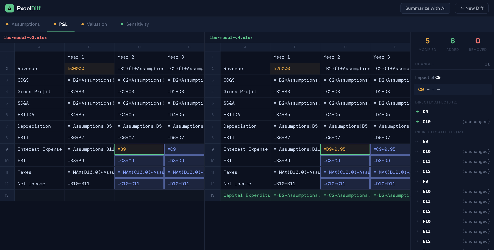
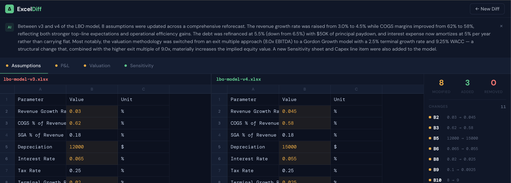

# ExcelDiff

**Git diff for financial models.** Drop two Excel files. See every cell, formula, and structural change.


---

## Features

### Side-by-Side Spreadsheet Diff

Two synced grids — left is before, right is after. All cells visible. Changed cells are highlighted: amber (modified), green (added), red (removed). Scroll one panel, both scroll. Just like VSCode's git diff, but for spreadsheets.



### Impact Ripple Tracing

Click any changed cell and see **every downstream cell it affects** — highlighted directly on the grid. The sidebar shows the full dependency chain: direct dependents and indirect (transitive) dependents across sheets. No other Excel diff tool does this.

*Example: click the Revenue Growth Rate cell on the Assumptions sheet, and watch the entire P&L light up — Revenue, COGS, Gross Profit, EBITDA, EBIT, EBT, Net Income, all 5 forecast years, plus Valuation and Sensitivity sheets.*



### Formula Token Diff

When a formula changes, ExcelDiff doesn't just say "formula changed." It shows you **exactly which tokens changed** inside the formula — inline, color-coded, like GitHub's word-level diff.

```
Before:  =B9
After:   =B9*0.95
         ──  ─────
         same added
```

Double-click any changed cell to see the full detail popover with old/new values, formula token diff, and number format changes.

### AI-Powered Change Summary

One click generates a plain-English summary of what changed between versions — written for a finance professional, not a developer.

> *"Between v3 and v4 of the LBO model, 8 assumptions were updated across a comprehensive reforecast. The revenue growth rate was raised from 3.0% to 4.5% while COGS margins improved from 62% to 58%. Most notably, the valuation methodology was switched from an exit multiple approach to a Gordon Growth model — a structural change that materially increases the implied equity value."*



### Multi-Sheet Navigation

Sheet tabs with color-coded status dots show at a glance which sheets changed, which are new, and which are identical. Click to switch — the diff grids update instantly.

---

## Quick Start

```bash
npm install
npm run dev
```

Open `http://localhost:5173`. Drop two `.xlsx` or `.csv` files. Click Compare.

## How to Use

1. **Drop files** — drag your "before" file to the left zone, "after" to the right
2. **Click Compare** — parsing happens in a Web Worker, UI stays responsive
3. **Browse sheets** — use the tab bar to switch between sheets
4. **Click a changed cell** — see the impact ripple across the grid + dependency chain in the sidebar
5. **Double-click** — open the detail popover with formula token diff
6. **Summarize with AI** — get a plain-English summary of the model update

## Tech Stack

| Layer | Choice |
|-------|--------|
| Framework | React 19 + TypeScript 5.9 |
| Build | Vite 8 |
| State | Zustand |
| Excel parsing | ExcelJS (MIT, in Web Worker) |
| Virtual scroll | @tanstack/react-virtual |
| Styling | CSS Modules + design tokens |
| AI | Anthropic Claude API (optional) |

## Architecture

```
src/
├── core/               # Pure TypeScript — zero React
│   ├── types.ts        # Shared interfaces
│   ├── parser.ts       # ExcelJS → ParsedWorkbook
│   ├── differ.ts       # Sheet + cell-level diff
│   ├── dependencyGraph.ts  # Formula DAG for impact tracing
│   ├── tokenizer.ts    # Formula lexer + LCS token diff
│   └── sorter.ts       # Row-major cell sort
├── worker/
│   └── diffWorker.ts   # Web Worker — parsing + diffing off main thread
├── components/
│   ├── SpreadsheetDiff/ # Side-by-side synced grids
│   ├── MiniSidebar/     # Stats + change navigator + impact panel
│   ├── CellPopover/     # Detail modal with formula token diff
│   ├── ImpactPanel/     # Dependency chain visualization
│   └── AISummary/       # AI-powered change summary
├── store.ts            # Zustand — view state machine
└── views/
    ├── Landing/         # File upload with drag & drop
    └── Viewer/          # Diff viewer layout
```

All parsing and diffing runs in a Web Worker. The dependency graph is built during parse — clicking a cell traces impact with zero latency.

---